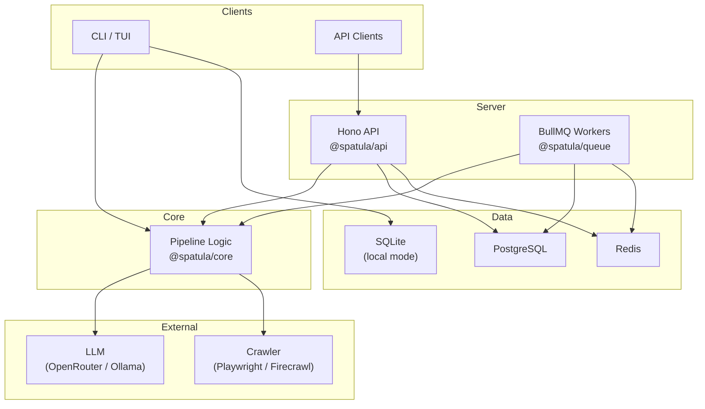

# Spatula

**AI-powered intelligent web crawling. Describe the data you want, get clean production-ready datasets.**

[](https://github.com/spatulaai/spatula/actions/workflows/ci.yml)
[](https://opensource.org/licenses/MIT)

> **Legal Notice:** Spatula is provided as-is under the [MIT License](LICENSE). You are
> responsible for complying with the Terms of Service of any website you crawl, as well as
> all applicable laws (including but not limited to GDPR, DMCA, and CFAA). Spatula honors
> `robots.txt` by default; disabling `robots.txt` enforcement is at your own risk and
> legal responsibility. The Spatula project and Accidentally Awesome Labs accept no
> liability for misuse.

## What is Spatula?

Spatula is an AI-powered web crawling platform that turns unstructured websites into clean, structured datasets. You describe the data you want in plain language, provide seed URLs, and Spatula handles the rest — crawling pages, extracting structured data with LLMs, evolving the schema as it discovers new fields, reconciling entities across sources, and exporting production-ready datasets. It works locally as a CLI tool or as a multi-tenant API server.

## Features

- **Natural language data description** — define what you want to extract in `spatula.yaml`, not XPath
- **LLM-powered extraction** — uses AI at every decision point with smart model routing for cost control
- **Automatic schema evolution** — discovers new fields as it crawls, with human-in-the-loop review
- **Entity reconciliation** — matches and merges the same entity found across different pages and sites
- **5 export formats** — JSON, CSV, Parquet, SQLite, DuckDB — all with field-level provenance
- **Dual execution mode** — run locally with SQLite or as a multi-tenant server with PostgreSQL + Redis
- **Pluggable crawlers** — Playwright (built-in) or Firecrawl (API-based)
- **Pluggable LLM providers** — OpenRouter (cloud) or Ollama (local, fully offline)
- **55 typed actions** — every mutation is a reviewable, auditable action
- **Interactive TUI** — explore data, review schema changes, and monitor crawls from the terminal

## Quickstart

### Local Mode

```bash
# Install
npm install -g @spatula/cli

# Create a project
mkdir my-project && cd my-project
spatula init

# Or start with the conversational wizard
spatula new

# Configure your LLM provider
spatula setup

# Run the crawl
spatula run

# Explore results
spatula explore

# Export
spatula export --format json
```

### Server Mode

```bash
# Clone the repository
git clone https://github.com/spatulaai/spatula.git
cd spatula

# Install dependencies
pnpm install

# Start PostgreSQL and Redis
docker compose up -d

# Configure environment
cp .env.example .env
# Edit .env — set at minimum: OPENROUTER_API_KEY

# Run database migrations
pnpm --filter @spatula/db migrate

# Start the API server
pnpm --filter @spatula/api start

# Start background workers
pnpm --filter @spatula/queue start:workers
```

The API is available at `http://localhost:3000`. Swagger UI is at `http://localhost:3000/api/docs`.

## Architecture Overview



See [docs/architecture.md](docs/architecture.md) for the full architecture guide with data flow diagrams, interface maps, and the action taxonomy.

## Configuration

### Project Configuration (`spatula.yaml`)

```yaml
name: My Project
seeds:
  - https://example.com/products

fields:
  - product_name: string
  - price: currency
  - in_stock: boolean

depth: 3
limit: 1000
crawler: playwright
safety: balanced
```

See [examples/](examples/) for complete configuration examples covering ecommerce, news, and real estate use cases.

### Environment Variables

| Variable                           | Required | Default                  | Description                                           |
| ---------------------------------- | -------- | ------------------------ | ----------------------------------------------------- |
| `OPENROUTER_API_KEY`               | Yes\*    | —                        | OpenRouter API key for cloud LLM                      |
| `OLLAMA_BASE_URL`                  | No       | `http://localhost:11434` | Ollama endpoint for local LLM                         |
| `DATABASE_URL`                     | Server   | —                        | PostgreSQL connection string                          |
| `REDIS_URL`                        | Server   | —                        | Redis connection string                               |
| `AUTH_STRATEGY`                    | No       | `none`                   | Auth mode. Use `api-key` or `jwt` in production       |
| `FIRECRAWL_API_KEY`                | No       | —                        | Firecrawl API key (if using Firecrawl crawler)        |
| `CONTENT_STORE`                    | No       | `postgres`               | Storage backend: `postgres` or `s3`                   |
| `SPATULA_ALLOW_PRIVATE_CRAWL_URLS` | No       | `0` in production        | Allows private/link-local crawl seeds when set to `1` |
| `SENTRY_DSN`                       | No       | —                        | Sentry error tracking endpoint                        |
| `LOG_LEVEL`                        | No       | `info`                   | Log level: `debug`, `info`, `warn`, `error`           |

\* Not required when using Ollama. See [.env.example](.env.example) for the full list.

## CLI Usage

| Command              | Description                                        |
| -------------------- | -------------------------------------------------- |
| `spatula init`       | Initialize a new project in the current directory  |
| `spatula new`        | Interactive project creation wizard                |
| `spatula run`        | Run the crawl pipeline (press `[d]` for dashboard) |
| `spatula status`     | Show project status and run history                |
| `spatula explore`    | Browse extracted entities in a TUI                 |
| `spatula review`     | Review pending schema actions in a TUI             |
| `spatula export`     | Export data (json, csv, sqlite, parquet, duckdb)   |
| `spatula schema`     | View current schema and version history            |
| `spatula logs`       | View run logs (`--tail` for live follow)           |
| `spatula add <url>`  | Add seed URLs to the project                       |
| `spatula estimate`   | Estimate crawl cost before running                 |
| `spatula doctor`     | Diagnose environment and project health            |
| `spatula test <url>` | Test extraction on a single page                   |
| `spatula config`     | Open project config in your editor                 |
| `spatula setup`      | Reconfigure global settings (LLM, crawler)         |
| `spatula reset`      | Reset project data for a fresh crawl               |

## API Reference

The API server exposes a RESTful JSON API with OpenAPI documentation.

**Interactive docs:** `http://localhost:3000/api/docs` (Swagger UI)

**Key endpoints:**

| Method | Path                                             | Description                  |
| ------ | ------------------------------------------------ | ---------------------------- |
| `POST` | `/api/v1/jobs`                                   | Create a crawl job           |
| `GET`  | `/api/v1/jobs/:jobId`                            | Get job status               |
| `GET`  | `/api/v1/jobs/:jobId/entities`                   | List extracted entities      |
| `GET`  | `/api/v1/jobs/:jobId/schema`                     | Get current schema           |
| `GET`  | `/api/v1/jobs/:jobId/actions`                    | List pending actions         |
| `POST` | `/api/v1/jobs/:jobId/actions/:actionId/approve`  | Approve a schema action      |
| `POST` | `/api/v1/jobs/:jobId/export`                     | Create an export             |
| `GET`  | `/api/v1/jobs/:jobId/exports/:exportId/download` | Download export file         |
| `POST` | `/api/v1/actions/batch`                          | Bulk approve/reject actions  |
| `POST` | `/api/v1/jobs/batch`                             | Bulk cancel/delete jobs      |
| `GET`  | `/api/v1/usage`                                  | LLM usage and cost breakdown |
| `GET`  | `/health`                                        | Health check                 |

All endpoints require authentication when `AUTH_STRATEGY` is set to `api-key` or `jwt`. `AUTH_STRATEGY=none` is for local development only. See [.env.example](.env.example) for auth configuration.

## Export Formats

| Format  | Extension  | Best For                           | Streaming | Provenance |
| ------- | ---------- | ---------------------------------- | --------- | ---------- |
| JSON    | `.json`    | APIs, nested data                  | Yes       | Yes        |
| CSV     | `.csv`     | Spreadsheets, simple tabular data  | Yes       | No         |
| Parquet | `.parquet` | Big data analytics (Spark, DuckDB) | No        | Yes        |
| SQLite  | `.db`      | Local querying, portable database  | No        | Yes        |
| DuckDB  | `.duckdb`  | Analytics, columnar queries        | No        | Yes        |

```bash
# Export with provenance metadata
spatula export --format json --include-provenance

# Export only high-quality entities
spatula export --format csv --min-quality 0.8

# Export to a specific path
spatula export --format sqlite --output ./data/products.db
```

## Development

```bash
# Install dependencies
pnpm install

# Build all packages
pnpm build

# Run all tests
pnpm test

# Run E2E tests (requires Docker services)
pnpm test:e2e

# Lint
pnpm lint

# Type check
pnpm typecheck

# Format check
pnpm format:check
```

### Project Structure

```
spatula/
├── apps/
│   ├── api/          # Hono REST API server
│   └── cli/          # CLI + TUI application
├── packages/
│   ├── core/         # Types, interfaces, pipeline logic
│   ├── db/           # PostgreSQL + SQLite, Drizzle ORM
│   ├── queue/        # BullMQ workers, webhooks
│   └── shared/       # Logging, auth, metrics, errors
├── tests/e2e/        # End-to-end API tests
├── examples/         # Example project configurations
└── docs/             # Architecture and design docs
```

## Contributing

See [CONTRIBUTING.md](CONTRIBUTING.md) for development setup, coding standards, and the pull request process.

## License

[MIT](LICENSE)
