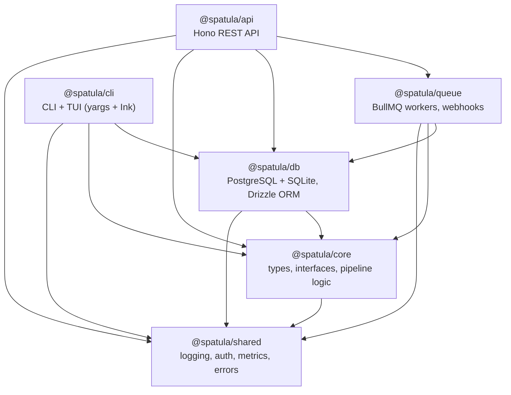
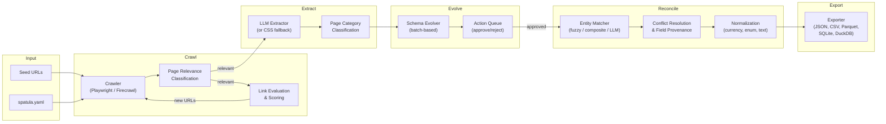

# Spatula Architecture

This document describes the internal architecture of Spatula — the package structure, data flow, core interfaces, action system, and LLM integration points.

## OSS / Private-SaaS Carve-out (v1.1, Phase 15)

As of v1.1, all commercial-tier infrastructure (payment integration, tenant-tier presets, usage aggregation, hourly meter worker, payment-webhook handlers) lives in the private `accidentally-awesome-labs/spatula-saas` repo. The OSS server (this repo) deploys with **zero commercial-tier surface area**. Self-hosters use the config-driven `DEFAULT_RATE_LIMIT` constant and per-tenant `TenantQuotas` (no tier presets).

The 5-package OSS surface that the private `spatula-saas` repo consumes (`@spatula/{core,db,queue,shared,api}`) is frozen by the reverse-contract test suite in `tests/private-contract/` (TS-symbol freeze + SQL schema lint via `pg_dump`). The authoritative surface enumeration plus a residual-risk register lives in [`docs/private-contract.md`](./private-contract.md). The forward-contract suite in `tests/carveout/` proves the OSS-only server boots and serves its post-carve API contract end-to-end.

Migration history is namespaced: the OSS migrations track via `drizzle.__drizzle_migrations_oss`, and the private repo reserves `drizzle.__drizzle_migrations_saas`. A single Postgres instance can host both. See [`docs/runbooks/upgrade.md`](./runbooks/upgrade.md) for the no-migration-downgrade + expand-contract-only policies that govern post-v1 schema evolution.

## Package Dependency Graph

**Design principle:** `@spatula/core` is a pure library with zero HTTP, CLI, or queue knowledge. The API and CLI are thin clients that compose core interfaces with infrastructure.

## Data Flow

### Pipeline Stages

1. **Crawl** — Fetch pages from seed URLs. Respect robots.txt, rate limits, and page budget. Evaluate discovered links for crawl priority.
2. **Classify** — LLM determines page relevance (is this page about the target data?) and page category (product page vs listing page vs article).
3. **Extract** — LLM extracts structured fields from relevant pages. Falls back to CSS-selector extraction when no LLM is configured.
4. **Schema Evolution** — Batched analysis of unmapped fields across pages. Proposes schema changes as actions requiring human review.
5. **Reconcile** — Match entities across pages (same product from different URLs), resolve conflicting field values, normalize data types.
6. **Export** — Output clean datasets in 5 formats. JSON exports can include field provenance metadata (extracted, normalized, merged, resolved, inferred) when requested.

## Core Interfaces

Spatula is interface-driven — every major component is a contract with pluggable implementations.

| Interface        | File                                              | Implementations                                                                          |
| ---------------- | ------------------------------------------------- | ---------------------------------------------------------------------------------------- |
| `Crawler`        | `packages/core/src/interfaces/crawler.ts`         | `PlaywrightCrawler`, `FirecrawlCrawler`                                                  |
| `Extractor`      | `packages/core/src/interfaces/extractor.ts`       | `LLMExtractor`, `CssExtractor`                                                           |
| `LLMClient`      | `packages/core/src/interfaces/llm-client.ts`      | `OpenRouterClient`, `OllamaClient`, `CircuitBreakerLLMClient`                            |
| `ContentStore`   | `packages/core/src/interfaces/content-store.ts`   | `FilesystemContentStore`, `S3ContentStore`                                               |
| `DataSource`     | `packages/core/src/interfaces/data-source.ts`     | `LocalDataSource` (SQLite), API client (planned)                                         |
| `SchemaEvolver`  | `packages/core/src/interfaces/schema-evolver.ts`  | `LLMSchemaEvolver`                                                                       |
| `Reconciler`     | `packages/core/src/interfaces/reconciler.ts`      | `LLMReconciler`                                                                          |
| `Exporter`       | `packages/core/src/interfaces/exporter.ts`        | `JsonExporter`, `CsvExporter`, `ParquetExporter`, `SqliteExporter`, `DuckDbExporter`     |
| `ActionExecutor` | `packages/core/src/interfaces/action-executor.ts` | Pipeline action executor                                                                 |
| `ConfigExecutor` | `packages/core/src/interfaces/config-executor.ts` | Config action executor                                                                   |
| `Orchestrator`   | `packages/core/src/interfaces/orchestrator.ts`    | `CrawlOrchestrator`, `SchemaOrchestrator`, `ReconcileOrchestrator`, `ExportOrchestrator` |

### Dual Execution Model

Spatula runs in two modes:

- **Server mode** — PostgreSQL + Redis + BullMQ. API server handles HTTP requests, BullMQ workers process jobs asynchronously. Multi-tenant.
- **Local mode** — SQLite + in-memory queues. `spatula run` executes the full pipeline in-process. Single-project.

Both modes use the same orchestrator functions from `@spatula/core`. The server wraps them in BullMQ workers; the CLI calls them directly via `LocalPipelineRunner`.

## SQLite Backend Decision

**Decision (v1.0): stay on `better-sqlite3@12.10.0` as the local-mode SQLite backend.** Re-evaluate at v2.0.

### Method

Benchmark + feature-parity script at `packages/db/bench/sqlite-comparison.ts`. Reproducible via `pnpm --filter @spatula/db exec tsx ../../packages/db/bench/sqlite-comparison.ts`; results captured in `packages/db/bench/sqlite-comparison.results.md` (timestamped, regenerated each run).

The script applies the three gates from spec §3.2.3 — feature parity (FTS5 / WAL / JSON1 / foreign keys / CHECK constraints), perf parity (10k inserts / selects / single-tx inserts), and non-experimental status — against both backends.

### Findings

1. **FTS5 (decisive — Pitfall #7):** On the v1.0 supported runtime (Node 22 LTS), `node:sqlite` is built against an older SQLite version that lacks FTS5. On developer machines running Node 26+, `node:sqlite` may report FTS5 as AVAILABLE (newer upstream SQLite), but the deployment platform we ship against is Node 22 LTS — so FTS5 parity is NOT guaranteed across the support matrix. Spatula's design contemplates FTS5 for entity-name search post-v1; dropping FTS5 capability now would force a dependency re-introduction later. `better-sqlite3` ships its own SQLite build with FTS5 enabled across every supported Node line.
2. **JSON1 / WAL:** Both backends support these on all tested Node lines.
3. **Perf:** `node:sqlite` and `better-sqlite3` are within the same order of magnitude for every workload tested. Neither is a discriminator at v1.0 local-mode scale.
4. **Experimental status:** `node:sqlite` is marked Experimental (stability index 1) through Node 22 LTS. Production self-hosters cannot rely on Experimental API stability across patch releases.

### Decision

**Stay on `better-sqlite3@12.10.0`.** The local-mode SQLite backend is part of Spatula's `support-matrix.md` — switching to an Experimental API on the LTS runtime trades a known-good audited dep for a stability-uncertain bundled one with feature-parity gaps. Re-evaluate at v2.0.

### Re-evaluation criteria

- The next Node LTS line lists `node:sqlite` as Stable.
- Node-bundled SQLite includes FTS5 on every supported Node LTS line.
- Spatula's codebase has been refactored to use only the intersection of `better-sqlite3` + `node:sqlite` APIs (no `db.transaction(fn)` ergonomic; manual `BEGIN`/`COMMIT` instead; no `Statement.iterate()`).

All three must hold to consider the swap.

## Export format stability

Spatula exports data in **5 formats frozen at v1**: JSON, CSV, Parquet, SQLite, DuckDB. The wire shape of each format is FROZEN — additive-only across 1.x; removing or restructuring exported columns is a MAJOR break (see `docs/compat-policy.md`). JSON can include per-field provenance metadata (one of: `extracted`, `normalized`, `merged`, `resolved`, `inferred`) when `includeProvenance` is true. The other v1 exporters write the flattened entity data only.

| Format  | Provenance support                      | Use case                                  |
| ------- | --------------------------------------- | ----------------------------------------- |
| JSON    | Optional per-record `provenance` object | Programmatic consumption; SDK round-trips |
| CSV     | No provenance columns in v1             | Spreadsheet / quick inspection            |
| Parquet | No provenance column in v1              | Analytical queries; columnar warehouse    |
| SQLite  | No provenance sidecar table in v1       | Embeddable; offline analysis              |
| DuckDB  | No provenance table or view in v1       | Analytical queries; SQL-native            |

**Why frozen at v1:** downstream consumers (BI pipelines, embedded apps shipping `.sqlite` files, analytical jobs over `.parquet`) cannot tolerate per-minor shape changes. Treating the export wire shape as part of the API contract — same freeze rules as the OpenAPI surface — is a deliberate v1 promise.

See `packages/core/src/exporters/` for the implementations (`json-exporter.ts`, `csv-exporter.ts`, `parquet-exporter.ts`, `sqlite-exporter.ts`, `duckdb-exporter.ts`).

## Action System

All data mutations flow through typed **actions**. Actions are proposals that may require human review before execution.

### Action Categories

| Category           | Count | Examples                                                                                                                                                |
| ------------------ | ----- | ------------------------------------------------------------------------------------------------------------------------------------------------------- |
| **Schema**         | 9     | `ADD_FIELD`, `MODIFY_FIELD`, `REMOVE_FIELD`, `RENAME_FIELD`, `SPLIT_FIELD`, `GROUP_FIELDS`, `MERGE_FIELDS`, `RECOMMEND_TABLE_STRUCTURE`, `DERIVE_FIELD` |
| **Normalization**  | 2     | `SET_NORMALIZATION_RULE`, `UPDATE_ENUM_MAP`                                                                                                             |
| **Category**       | 3     | `DEFINE_CATEGORY`, `ASSIGN_CATEGORY_FIELDS`, `CLASSIFY_PAGE`                                                                                            |
| **Crawl**          | 1     | `ENQUEUE_LINKS`                                                                                                                                         |
| **Reconciliation** | 7     | `HINT_ENTITY_MATCH`, `MATCH_ENTITIES`, `SPLIT_ENTITIES`, `RESOLVE_CONFLICT`, `INFER_VALUE`, `CORRECT_VALUE`, `SET_SOURCE_TRUST`                         |
| **Reprocessing**   | 1     | `REPROCESS_EXTRACTION`                                                                                                                                  |
| **Quality**        | 1     | `FLAG_ANOMALY`                                                                                                                                          |
| **Documentation**  | 1     | `GENERATE_DOCUMENTATION`                                                                                                                                |
| **Config**         | 30    | Seed management, field configuration, crawl settings, LLM tuning, export preferences                                                                    |

**Total: 55 action types** (25 pipeline + 30 config).

### Safety Levels

Each project defines a `safety` level controlling how actions are handled:

| Level      | Behavior                                            |
| ---------- | --------------------------------------------------- |
| `trust_ai` | All actions auto-approved                           |
| `balanced` | Low-risk auto-approved, high-risk queued for review |
| `cautious` | Most actions queued for review                      |
| `manual`   | All actions queued for review                       |

## LLM Usage Map

LLM inference is used at 8 decision points, each routable to a different model tier:

| Task                 | Purpose                                       | Default Tier     | Why                        |
| -------------------- | --------------------------------------------- | ---------------- | -------------------------- |
| `pageRelevance`      | Is this page about our target data?           | Fast (Haiku)     | High volume, simple yes/no |
| `linkEvaluation`     | Should we follow this link?                   | Fast (Haiku)     | High volume, scoring task  |
| `extraction`         | Extract structured fields from page           | Primary (Sonnet) | Core accuracy requirement  |
| `schemaEvolution`    | Propose new fields from unmapped data         | Primary (Sonnet) | Complex reasoning          |
| `entityMatching`     | Are these the same real-world entity?         | Primary (Sonnet) | Fuzzy matching             |
| `conflictResolution` | Which value is correct when sources disagree? | Primary (Sonnet) | Judgment call              |
| `qualityAudit`       | Verify extraction quality                     | Primary (Sonnet) | Accuracy check             |
| `documentation`      | Generate field descriptions                   | Fast (Haiku)     | Simple text generation     |

Model routing is configured per-project in `spatula.yaml` under `llm.overrides`. The `model-router.ts` resolves the model for each task by checking: task-specific override > project default > global config default.
